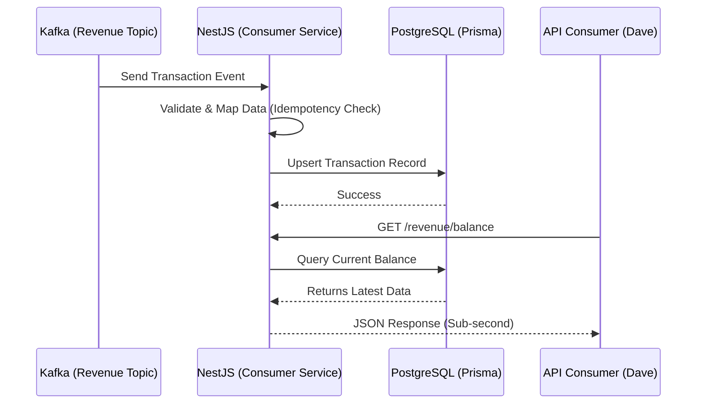
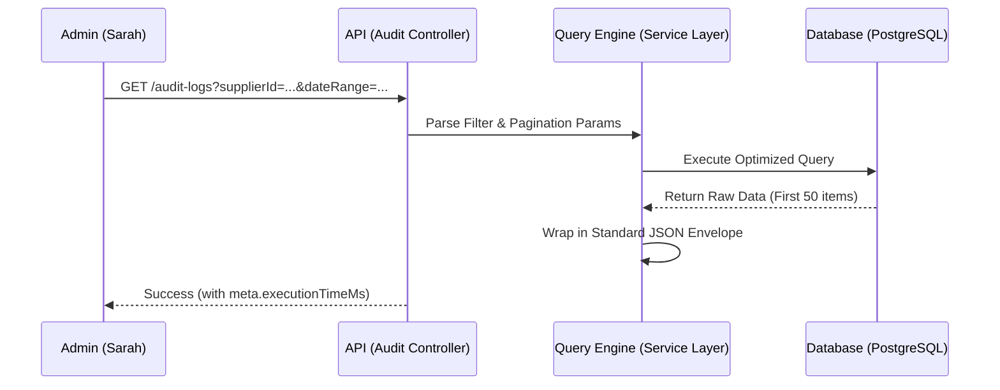
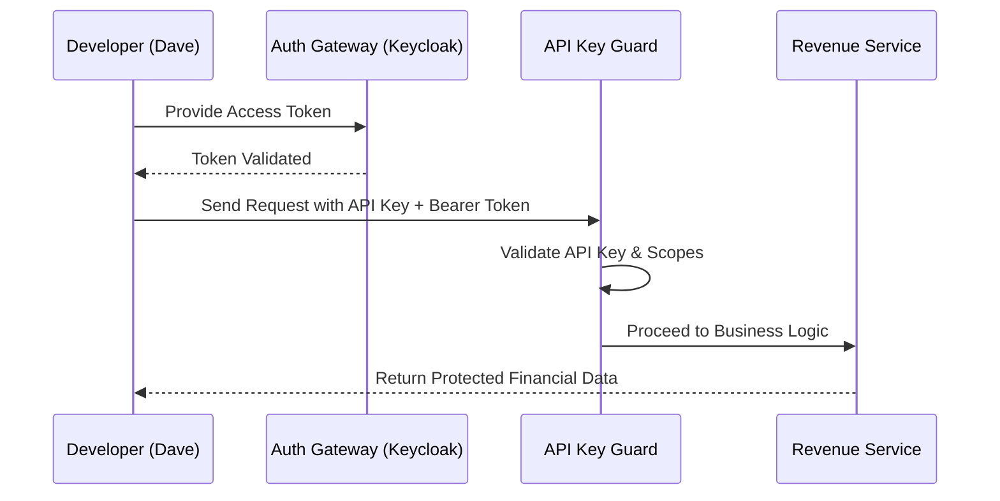

# UX Design Specification sr-be-node-nest

**Author:** Anucha-tk
**Date:** 2026-05-11

---

<!-- UX design content will be appended sequentially through collaborative workflow steps -->

## Executive Summary

### Project Vision

สร้าง Dashboard รายได้สำหรับซัพพลายเออร์ที่เน้นความเร็วและความโปร่งใส (Transparency) รองรับการประมวลผลข้อมูลมหาศาล (1M+ records) บน Desktop โดยเน้นแก้ปัญหาเรื่องการรอนาน (Query Latency) ให้ผู้ใช้ได้รับประสบการณ์ที่รวดเร็วและแม่นยำ

### Target Users

- **Supplier Owners (Somsak)**: ใช้งานผ่าน Desktop เป็นหลัก ต้องการเห็นยอดเงินคงเหลือแบบ Real-time เพื่อบริหารจัดการกระแสเงินสดและค่าจ้างพนักงาน
- **Operations Admins (Sarah)**: จัดการซัพพลายเออร์จำนวนมาก ต้องการระบบค้นหาและกรองข้อมูลที่รวดเร็ว (Fast Searching) และมีประวัติการตรวจสอบ (Audit Trail) ที่ชัดเจน
- **Developers (Dave)**: เชื่อมต่อระบบผ่าน API ที่มีความเสถียรและเอกสารที่ชัดเจน

### Key Design Challenges

- **Performance Perception**: การออกแบบ Interface ให้รู้สึก "เร็ว" แม้ต้องจัดการกับข้อมูลระดับล้านชุด โดยใช้เทคนิคการแสดงผลแบบ Optimized Views และระบบ Feedback ที่รวดเร็ว
- **Real-Time Confidence**: การสื่อสารสถานะการอัปเดตข้อมูล (Live Updates) จาก Kafka ให้ผู้ใช้มั่นใจว่าตัวเลขล่าสุดเสมอโดยไม่รบกวนการทำงาน
- **Efficient Filtering**: สร้างระบบตัวกรองข้อมูลที่ทรงพลังแต่ใช้งานง่าย เพื่อลดเวลาในการค้นหาธุรกรรมท่ามกลางข้อมูลมหาศาล

### Design Opportunities

- **Showcase Performance**: เปลี่ยนการคำนวณที่ซับซ้อนให้กลายเป็นข้อได้เปรียบเชิง UX ด้วยความเร็วในการ Query ที่ต่ำกว่า 1 วินาที
- **Seamless Security**: การรวมระบบ Keycloak และ API Keys ให้กลายเป็นประสบการณ์การเข้าถึงที่ปลอดภัยและราบรื่น (Premium Auth Experience)

## Core User Experience

### Defining Experience

ประสบการณ์หลักมุ่งเน้นไปที่ **"Real-Time Financial Empowerment"** โดยเปลี่ยนจากความรู้สึกที่ต้อง "รอข้อมูล" มาเป็นการ "เห็นข้อมูลและตัดสินใจได้ทันที" ผ่านหน้าจอที่มีประสิทธิภาพสูงและมีความแม่นยำระดับ Senior-level

### Platform Strategy

- **Primary Platform**: Desktop Web Browser
- **Interaction Model**: เน้นการใช้งานผ่าน Mouse และ Keyboard เป็นหลัก ออกแบบให้รองรับการจัดการข้อมูลจำนวนมหาศาล (Data Density) ด้วยตารางข้อมูลอัจฉริยะและการกรองที่ซับซ้อน
- **Performance Requirement**: การค้นหาและกรองข้อมูล 1M+ records ต้องรู้สึกเหมือนเข้าถึงข้อมูลในเครื่องตัวเอง (Near-zero latency)

### Effortless Interactions

- **Instant Search**: การค้นหาประวัติ Invoice นับล้านชุดต้องทำได้รวดเร็วเหมือนการค้นหาไฟล์ในเครื่อง
- **Zero-Refresh Updates**: ยอดเงินรายได้ต้องอัปเดตแบบ Real-time โดยไม่ต้องกด Refresh หน้าจอ (ผ่านระบบ Event-driven จาก Kafka)
- **Seamless Auth**: ระบบการยืนยันตัวตนผ่าน Keycloak ที่มีความปลอดภัยสูงแต่ไม่สร้างภาระให้ผู้ใช้

### Critical Success Moments

- **The Payout Signal**: จังหวะที่ซัพพลายเออร์เห็นยอดเงินอัปเดตทันทีที่ Invoice ถูกจ่าย ทำให้เขามั่นใจที่จะดำเนินการจ่ายเงินเดือนพนักงานต่อได้
- **The Audit Resolution**: จังหวะที่แอดมินสามารถค้นหาและตรวจสอบที่มาของธุรกรรมที่ซับซ้อนเจอภายในไม่กี่วินาที เพื่อยุติปัญหาข้อพิพาทด้านตัวเลข

### Experience Principles

- **Speed as a Utility**: ประสิทธิภาพไม่ใช่แค่การปรับจูนโค้ด แต่คือคุณค่าหลักของแอปพลิเคชัน
- **Radical Transparency**: ข้อมูลทางการเงินทุกชุดต้องตรวจสอบย้อนหลังได้ (Traceable) แก้ไขไม่ได้ (Immutable) และเชื่อถือได้
- **Contextual Clarity**: แสดงผลเฉพาะข้อมูลทางการเงินที่สำคัญที่สุด (เช่น ยอดคงเหลือ, แนวโน้ม) ไว้ในลำดับบนสุดของความสำคัญ

## Desired Emotional Response

### Primary Emotional Goals

เป้าหมายสูงสุดคือ **"Absolute Control"** (การควบคุมได้อย่างเบ็ดเสร็จ) ผู้ใช้ต้องรู้สึกว่าตนเองเป็นนายของข้อมูล (Master of Data) สามารถจัดการและเข้าถึงธุรกรรมนับล้านชุดได้โดยไม่ต้องพยายามและได้รับผลลัพธ์ทันที

### Emotional Journey Mapping

- **Login/Entry**: รู้สึกถึงความ **"เป็นมืออาชีพและปลอดภัย"** (Security & Professionalism)
- **Viewing Balance**: รู้สึก **"เบาใจและมั่นใจ"** (Reassurance) เมื่อเห็นยอดเงินที่อัปเดตแบบ Live
- **Investigating Data**: เปลี่ยนจากความสงสัยเป็น **"ความเชื่อมั่น"** (Trust) ผ่านประวัติการตรวจสอบที่ชัดเจน
- **Task Completion**: รู้สึกถึงความ **"มีประสิทธิภาพ"** (Efficiency) และความสำเร็จที่จัดการงานยากๆ ได้ในเวลาอันสั้น

### Micro-Emotions

- **Trust**: สร้างขึ้นผ่านสถานะการอัปเดตแบบ Real-time และ Log ธุรกรรมที่แก้ไขไม่ได้
- **Delight**: เกิดขึ้นเมื่อการค้นหาข้อมูลมหาศาลแสดงผลลัพธ์ได้ในเสี้ยววินาที
- **Calmness**: รักษาความสงบผ่าน Interface ที่สะอาดตา แม้ข้อมูลจะมีความหนาแน่นสูง

### Design Implications

- **Empowerment** → ใช้ระบบ Advanced Filtering ที่อัปเดตผลลัพธ์ทันทีโดยไม่ต้อง Refresh หน้าจอ
- **Confidence** → แสดงสถานะ "Last Updated" และการเชื่อมต่อ Kafka ให้เห็นชัดเจนตลอดเวลา
- **Trust →** เชื่อมโยงตัวเลขบน Dashboard เข้ากับ "Source of Truth" หรือ Log เหตุการณ์ดิบได้โดยตรง

### Emotional Design Principles

- **No-Lag Guarantee**: ความหน่วงคืออารมณ์ลบ ความเร็วคืออารมณ์บวก
- **Evidence-Based Design**: แสดงหลักฐาน (Audit logs) เพื่อสร้างความเชื่อมั่น
- **Minimal Cognitive Load**: ข้อมูลที่ซับซ้อนไม่จำเป็นต้องมีหน้าตาที่ใช้งานยาก

## UX Pattern Analysis & Inspiration

### Inspiring Products Analysis

- **Stripe Dashboard**: เป็นแรงบันดาลใจหลักในด้านความสะอาด (Cleanliness) และความเป็นมืออาชีพ การจัดการรายการธุรกรรมทางการเงินที่ดูเรียบง่ายแต่ทรงพลัง
- **Linear**: เป็นแรงบันดาลใจในด้านประสิทธิภาพ (Efficiency) การใช้ความเร็วเป็นฟีเจอร์หลักเพื่อให้แอปพลิเคชันรู้สึก "เบา" แม้จะใช้งานหนัก

### Transferable UX Patterns

- **High-Density Minimalist Tables**: การใช้ตารางที่มีความหนาแน่นข้อมูลสูงแต่ยังดูสะอาดตาด้วยการเลือกใช้ Typography (เช่น Inter) และการใช้พื้นที่ว่าง (Whitespace) อย่างเหมาะสม
- **Command-Palette Search**: ระบบค้นหาที่ทำหน้าที่เป็นศูนย์กลางการกรองข้อมูล (Filter) ช่วยให้ Sarah ค้นหาธุรกรรมได้ทันทีโดยไม่ต้องเปลี่ยนหน้า
- **Skeleton Loaders**: การแสดงโครงสร้างหน้าจอก่อนข้อมูลจะมาถึง เพื่อลดความรู้สึกที่ต้อง "รอ" และเพิ่มความมั่นใจว่าระบบกำลังทำงานอย่างรวดเร็ว

### Anti-Patterns to Avoid

- **Legacy Pagination**: หลีกเลี่ยงการใช้ปุ่มหน้า [1][2][3] แบบเดิมๆ ที่ทำให้รู้สึกช้า แต่จะใช้ระบบ Virtualized List หรือ Infinite Scroll เพื่อให้การดู 1M+ records ลื่นไหลที่สุด
- **Information Overload**: หลีกเลี่ยงการอัดกราฟหรือตัวเลขที่ยุ่งเหยิงในหน้าเดียว แต่จะใช้วิธีแสดงผลตามความสำคัญ (Contextual Display)
- **Full-Page Spinners**: หลีกเลี่ยงการล็อกหน้าจอด้วยตัวหมุนโหลดที่ทำให้เสียจังหวะการทำงาน

### Design Inspiration Strategy

- **Adopt**: เลือกใช้สไตล์ Typography และโทนสีขาว/เทาอ่อนแบบ Stripe เพื่อสร้างความเชื่อมั่นในระบบการเงิน
- **Adapt**: นำความเร็วและการตอบสนองแบบ Linear มาใช้ในการออกแบบ User Flow เพื่อให้ Somsak รู้สึกว่าระบบ "ทันใจ"
- **Avoid**: หลีกเลี่ยงดีไซน์แบบ Dashboard วิศวกรที่ดูซับซ้อนเกินไป (Technical Overload) เพื่อรักษาความ Minimal ตามโจทย์

## Interactive Showcase Frontend (Epic 5)

### Vision
สร้างหน้าจอพิเศษที่ใช้สำหรับการ Demo และ Presentation โดยเฉพาะ เน้นการเล่าเรื่อง (Storytelling) ผ่าน UI ที่สวยงามระดับ Premium เพื่อแสดงให้เห็นถึงความซับซ้อนของระบบ Backend (Kafka, Security, Performance) ในรูปแบบที่เข้าใจง่ายและน่าทึ่ง

### Design Principles
- **Visual Storytelling**: ใช้ Animation และ Motion (Framer Motion) ในการอธิบายการไหลของข้อมูล
- **Interactive Depth**: ผู้ใช้สามารถเจาะลึก (Drill-down) เข้าไปดูโค้ดหรือการทำงานจริงในแต่ละจุดได้
- **Real-time Feedback**: แสดงผลการประมวลผล Kafka แบบวินาทีต่อวินาที เพื่อยืนยันความเร็วของระบบ

### Key Sections
1. **The Architecture Map**: แผนผังระบบที่โต้ตอบได้ เมื่อคลิกที่ "Kafka" จะเห็นสถานะ Queue แบบ Real-time
2. **The Performance Lab**: กราฟแสดงความเร็วในการ Query ข้อมูล 1M+ records แบบเปรียบเทียบ
3. **The Security Vault**: สาธิตการทำงานของ Keycloak และ API Keys ผ่าน Interface ที่ดูล้ำสมัย
4. **Presentation Mode**: ระบบนำเสนอแบบสไลด์ที่ฝังอยู่ใน Dashboard ช่วยให้การ Demo เป็นไปอย่างราบรื่น

## Design System Foundation (API & Developer Experience)

### 1.1 Design System Choice

**Scalar UI** (Modern API Documentation) และ **RESTful JSON API Standards**

### Rationale for Selection

- **API-First Experience**: ในฐานะ Pure Backend "หน้าตา" ของโครงการคือ API Documentation ซึ่ง Scalar UI ให้ประสบการณ์ที่สวยงาม (Clean & Minimal) และใช้งานง่ายกว่า Swagger แบบเดิม
- **Consistency for Consumers**: การกำหนดมาตรฐาน Response Schema (เช่น JSON:API หรือโครงสร้างที่เป็นระเบียบ) ช่วยให้คนทำ Frontend ในอนาคตทำงานได้ง่ายขึ้น
- **Performance-Centric Design**: เน้นการออกแบบ Endpoint ที่รองรับการ Query ข้อมูล 1M+ records โดยส่งข้อมูลที่จำเป็นที่สุดเพื่อลด Latency

### Implementation Approach

- ใช้ **Scalar UI** เป็นหน้าหลักในการนำเสนอ API (ตรงตาม PRD)
- กำหนดมาตรฐานการส่งข้อมูลแบบ **Pagination & Filtering** ที่ฝั่ง Frontend สามารถเรียกใช้ได้ทันทีโดยไม่ต้องเขียน Logic ซับซ้อน

### Customization Strategy (API Design)

- **Semantic Naming**: ใช้ชื่อฟิลด์และ Endpoint ที่สื่อความหมายชัดเจน (เช่น `/revenue/balance` แทนที่จะเป็น `/get-data`)
- **Real-time Integration Guide**: ให้คำแนะนำในการเชื่อมต่อ Kafka สำหรับฝั่ง Consumer เพื่อให้เขาทำ UI ที่อัปเดตแบบ Real-time ได้

## 2. Core Developer Experience (UX)

### 2.1 Defining Experience

หัวใจสำคัญคือการส่งมอบงานที่ **"ไร้แรงเสียดทาน"** (Frictionless) เมื่อนักพัฒนาฝั่ง Frontend หรือ Partner เปิดหน้า Scalar/Swagger ขึ้นมา เขาต้องสามารถทำความเข้าใจ ทดสอบ และนำไปเชื่อมต่อกับระบบของเขาได้ทันทีโดยไม่ต้องกลับมาถามซ้ำ เป็นการออกแบบ API ที่ "อธิบายตัวเองได้" (Self-documenting API)

### 2.2 User Mental Model

นักพัฒนาฝั่ง Consumer มองว่า API คือ **"Black Box of Truth"** ที่พวกเขาคาดหวังความสม่ำเสมอ (Predictability), ความสามารถในการช่วยเหลือตนเองผ่านเอกสาร (Self-Sufficiency) และการยึดถือมาตรฐาน (Standards) เป็นสากล

### 2.3 Success Criteria

- **Documentation Autonomy**: นักพัฒนาคนอื่นสามารถใช้งาน API ได้สำเร็จ 100% โดยไม่มีคำถามกลับมายังทีม Backend
- **Pattern Uniformity**: โครงสร้าง Response และ Error ต้องเป็นรูปแบบเดียวกันทั้งโครงการ (Standardized Schema)
- **Speed & Reliability**: ข้อมูลล้านชุดต้องส่งกลับมาในเสี้ยววินาที และมีความแม่นยำสูง (Data Integrity)

### 2.4 Novel UX Patterns

เน้นการใช้ **Standardized API Response Envelopes** และ **Rich Error Objects** ที่บอกถึงสาเหตุและแนวทางการแก้ไข (Actionable Errors) เพื่อลดเวลาในการ Debug

### 2.5 Experience Mechanics

- **Initiation**: นักพัฒนาเปิด Scalar UI แล้วพบการจัดหมวดหมู่ Endpoint ที่ชัดเจน
- **Interaction**: ใช้ระบบ "Try it out" เพื่อเห็นตัวอย่างข้อมูลจริงได้ทันที
- **Feedback**: ระบบส่งข้อมูลกลับมาในรูปแบบ Standard Envelope ที่ระบุทั้งข้อมูล (Data) และข้อมูลกำกับ (Meta) เช่น Query Execution Time เพื่อยืนยันประสิทธิภาพ
- **Completion**: การเชื่อมต่อระบบ (Integration) ทำได้อย่างราบรื่นและมั่นใจ

## Visual & Schema Foundation

### Color System

- **Standard Scalar UI**: ใช้ธีมมาตรฐานของ Scalar UI ซึ่งมีความทันสมัย สะอาดตา และเป็นมิตรกับนักพัฒนาอยู่แล้ว โดยไม่ต้องปรับแต่งเพิ่มเติมเพื่อรักษาความเสถียรและความคุ้นเคย
- **Status Colors**: ใช้ระบบสีมาตรฐาน (เขียว=สำเร็จ, แดง=ผิดพลาด) ที่ปรากฏทั้งในหน้าเอกสารและในผลลัพธ์ของ API

### Typography System

- **Inter & System Mono**: อ้างอิงตามมาตรฐานของ Scalar UI เพื่อให้อ่านชื่อ Endpoint และ Code Snippets ได้ชัดเจนที่สุด

### Spacing & Layout Foundation (JSON Schema)

- **camelCase Convention**: ใช้ `camelCase` สำหรับทุก Key ใน JSON (เช่น `revenueBalance`, `invoiceId`)
- **Envelope Structure**: ทุกการตอบกลับจะใช้โครงสร้าง "Envelope" ที่สม่ำเสมอ:
  - `success`: Boolean ระบุสถานะการทำงาน
  - `data`: ข้อมูลหลักที่เรียกใช้
  - `meta`: ข้อมูลกำกับธุรกรรม (เช่น `timestamp`, `executionTimeMs`, `pagination`)
  - `error`: ข้อมูลข้อผิดพลาด (จะเป็น `null` หากสำเร็จ)

### Accessibility Considerations

- **Rich Error Objects**: ข้อผิดพลาดจะถูกส่งกลับเป็น Object ที่มีทั้ง Code และ Message ที่มนุษย์อ่านเข้าใจและเครื่องนำไปประมวลผลต่อได้ง่าย

## Design Direction Decision

### Design Directions Explored

- **Standardized Envelope Strategy**: การสำรวจวิธีใช้โครงสร้าง JSON ที่สม่ำเสมอ (`success`, `data`, `meta`, `error`) เพื่อเพิ่มความแม่นยำในการคาดเดาผลลัพธ์ของนักพัฒนา
- **High-Performance Pagination**: การแสดงวิธีการจัดการข้อมูลระดับล้านชุดผ่าน Pagination Metadata ที่ละเอียดและเข้าใจง่าย
- **Self-Documenting Errors**: การใช้ Rich Error Objects เพื่อลดคำถามจากนักพัฒนาฝั่ง Frontend

### Chosen Direction

**Unified Actionable Schema**: ตกลงเลือกรูปแบบการตอบกลับแบบ **Clean & Minimal** ที่ใช้ Envelope มาตรฐาน, การตั้งชื่อแบบ `camelCase` และการให้ข้อมูล Metadata ที่โปร่งใส (รวมถึงเวลาที่ใช้ในการประมวลผล เพื่อยืนยันประสิทธิภาพ)

### Design Rationale

- **Zero-Ambiguity**: การให้โครงสร้างที่แน่นอนทั้งในกรณีสำเร็จและผิดพลาด ช่วยลดความจำเป็นในการสื่อสารซ้ำซ้อน
- **Performance Proof**: การใส่ `executionTimeMs` ใน Metadata ทำหน้าที่เป็น "UX Feature" เพื่อสร้างความเชื่อมั่นในประสิทธิภาพ
- **Traceability**: โครงสร้างนี้รองรับการทำ Traceability กลับไปยัง Kafka Event ได้โดยตรง

### Implementation Approach

- ใช้ NestJS Global Interceptor และ Global Exception Filter ในการควบคุมรูปแบบการตอบกลับทั้งหมดให้เป็นมาตรฐานเดียวกัน

## User Journey Flows (API Sequence & Data Integrity)

### 1. Real-time Revenue Sync (Kafka to Consumer)

### 2. High-Performance Audit Retrieval

### 3. Secure Dashboard Access (Multi-Layer Auth)

### Journey Patterns (API Standards)

- **Retry Pattern**: ระบบ Consumer จะมีการทำ Retry อัตโนมัติหากการบันทึก DB ล้มเหลว
- **Graceful Error Handling**: ทุกเส้นทางหากเกิด Error จะต้องส่งกลับ Rich Error Object เสมอ

### Flow Optimization Principles

- **Idempotency**: ป้องกันข้อมูลซ้ำซ้อนจากการรับ Event เดิมจาก Kafka
- **Read-Heavy Optimization**: ใช้ Database Indexing ที่เน้นการอ่านเป็นหลักเพื่อรองรับ 1M+ records

## Component & Resource Strategy (API DTOs)

### API Resource Components

1. **`RevenueSummaryDTO`**: คอมโพเนนต์ข้อมูลสรุปสำหรับ Dashboard เน้นเฉพาะตัวเลขสำคัญ (Total Balance, Pending) เพื่อการแสดงผลที่รวดเร็วที่สุด
2. **`TransactionListItemDTO`**: ออกแบบให้มีความเป็น **"Minimalist"** สูงสุด (เช่น ID, Amount, Date, Status) เพื่อลดขนาด Payload สำหรับการดึงข้อมูลรายการธุรกรรมนับล้านชุด
3. **`AuditTrailDTO`**: คอมโพเนนต์ข้อมูลเชิงลึกสำหรับการตรวจสอบ รวมถึงรหัสอ้างอิงกลับไปยัง Kafka Source Events
4. **`StandardEnvelopeDTO`**: ตัวครอบข้อมูลมาตรฐาน (success, data, meta, error) ที่ใช้ในทุก Endpoint

### Component Implementation Strategy

- **Minimalist Payload Policy**: เราจะยึดหลัก "ส่งเฉพาะที่จำเป็น" (Necessity-Only) สำหรับข้อมูลรายการ (List) หากผู้ใช้ต้องการรายละเอียดเชิงลึก จะใช้การเรียกผ่าน Drill-down Endpoint แยกต่างหาก
- **Contextual Pagination**: ระบบ Pagination (limit, offset, total) จะถูกนำมาใช้ **"เฉพาะที่ที่เป็นรายการ (List)"** เท่านั้น
- **DTO Inheritance**: ใช้ NestJS Mapped Types ในการสร้างความสอดคล้องระหว่างข้อมูลที่รับมาจาก Kafka และข้อมูลที่จะส่งออก API

### Implementation Roadmap

- **Phase 1 - Core Financial DTOs**: กำหนดมาตรฐานข้อมูลสรุปและรายการธุรกรรมแบบ Optimized
- **Phase 2 - Error & Envelope Components**: พัฒนาระบบตัวครอบข้อมูลมาตรฐานและระบบจัดการข้อผิดพลาด
- **Phase 3 - Audit & Traceability Resources**: เพิ่มฟิลด์ Metadata สำหรับการตรวจสอบย้อนกลับไปยัง Kafka
- **Phase 4 - Interactive Showcase (Epic 5)**: พัฒนาหน้าจอ Presentation และระบบ Interactive Demo

## UX Consistency Patterns (API Interaction Patterns)

### API Versioning & URL Structure

- **Versioning Pattern**: ใช้เวอร์ชันกำกับใน URL ทุกครั้ง เช่น `/api/v1/...`
- **Resource Naming**: ใช้คำนามพหูพจน์ (Plural Nouns) สำหรับชื่อ Resource

### Filtering & Sorting Patterns

- **Filtering Pattern**: ใช้ Simple Query Parameters เช่น `?status=PAID&supplierId=123`
- **Sorting Pattern**: ใช้ Parameter `sort` โดยมีเครื่องหมาย `-` สำหรับการเรียงจากมากไปน้อย

### Pagination Standard

- **Standard Parameters**: ใช้ `limit` และ `offset` เป็นมาตรฐานสำหรับทุก List API
- **Metadata**: ข้อมูลการแบ่งหน้าจะถูกส่งกลับในฟิลด์ `meta.pagination` เสมอ

### Error Feedback Patterns

- **Categorized Error Codes**: ใช้รหัสข้อผิดพลาดเชิงธุรกิจที่แบ่งหมวดหมู่ชัดเจน (AUTH, VAL, REV)
- **HTTP Status Alignment**: รหัส Error ต้องสอดคล้องกับ HTTP Status Code

### Data Formatting Standards

- **Date-Time Pattern**: ใช้มาตรฐาน **ISO 8601** (UTC) เสมอ
- **Currency Pattern**: ข้อมูลการเงินส่งเป็นตัวเลข (Number) พร้อมทศนิยม 2 ตำแหน่ง
- **Empty Values**: ส่งกลับเป็น `null` สำหรับข้อมูลที่ไม่มีค่า และ `[]` สำหรับ Array ที่ว่างเปล่า

## API Performance & Discoverability (Backend Responsiveness)

### Performance Strategy (Responsive Data)

- **Payload Compression**: เปิดใช้งาน Gzip/Brotli Compression เป็นค่าเริ่มต้น
- **Selective Field Loading**: รองรับ Parameter `fields` เพื่อลดระยะเวลาในการประมวลผลและการส่งข้อมูล
- **Efficient Caching (ETags)**: ใช้ระบบ ETag เพื่อประหยัด Bandwidth และเวลาในการโหลด

### Rate Limiting & Timeout Strategy (API Breakpoints)

- **Tiered Rate Limiting**: กำหนดขีดจำกัดการใช้งานตามกลุ่มผู้ใช้ (Supplier vs Admin)
- **Fail-Fast Timeouts**: กำหนด Global Timeout ที่ 10 วินาที เพื่อคืนทรัพยากรให้ระบบโดยเร็ว

### Discoverability & Accessibility Strategy

- **Actionable Error Documentation**: ในทุก Error Response จะมีฟิลด์ `helpUrl` ที่ลิงก์ไปยังคู่มือโดยตรง
- **Documentation Accessibility**: ปรับแต่งหน้า Scalar UI ให้ผ่านมาตรฐาน WCAG 2.1 AA
