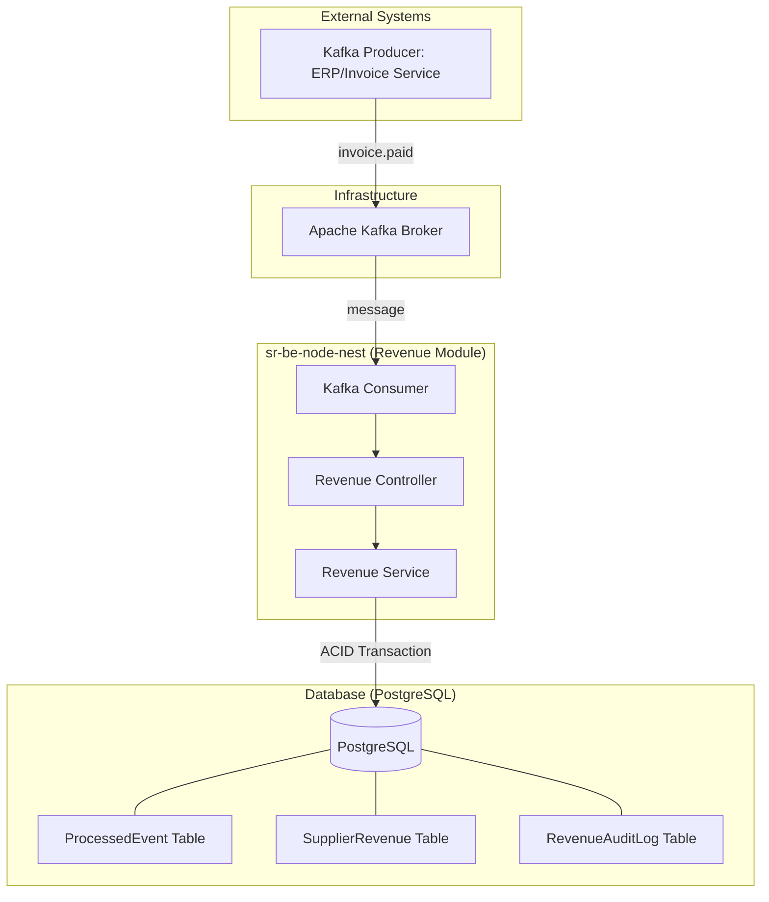

# System Architecture: Idempotent Revenue Engine

This diagram illustrates the high-level architecture of the revenue ingestion system, showing the flow from external event generation to database persistence.

