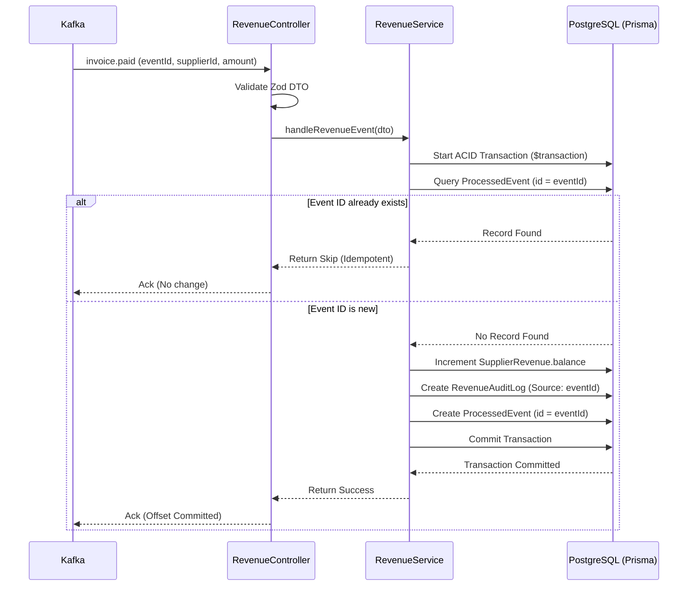

# Logic Flow: Idempotent Revenue Processing

This sequence diagram details the internal logic used to guarantee exactly-once processing for financial events.

```mermaid
sequenceDiagram
    participant K as Kafka
    participant C as RevenueController
    participant S as RevenueService
    participant DB as PostgreSQL (Prisma)

    K->>C: invoice.paid (eventId, supplierId, amount)
    C->>C: Validate Zod DTO
    C->>S: handleRevenueEvent(dto)
    
    S->>DB: Start ACID Transaction ($transaction)
    
    S->>DB: Query ProcessedEvent (id = eventId)
    
    alt Event ID already exists
        DB-->>S: Record Found
        S-->>C: Return Skip (Idempotent)
        C-->>K: Ack (No change)
    else Event ID is new
        DB-->>S: No Record Found
        S->>DB: Increment SupplierRevenue.balance
        S->>DB: Create RevenueAuditLog (Source: eventId)
        S->>DB: Create ProcessedEvent (id = eventId)
        S->>DB: Commit Transaction
        DB-->>S: Transaction Committed
        S-->>C: Return Success
        C-->>K: Ack (Offset Committed)
    end
```
